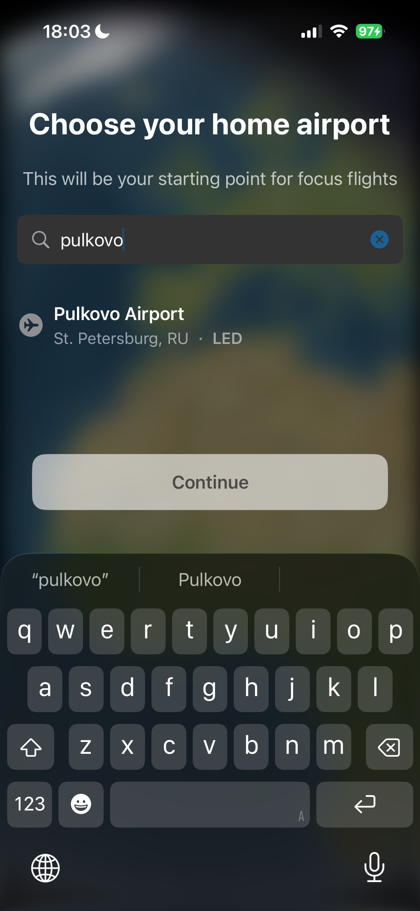
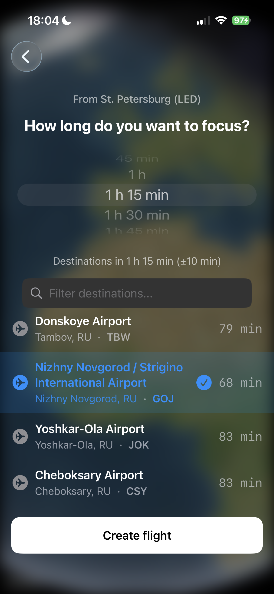
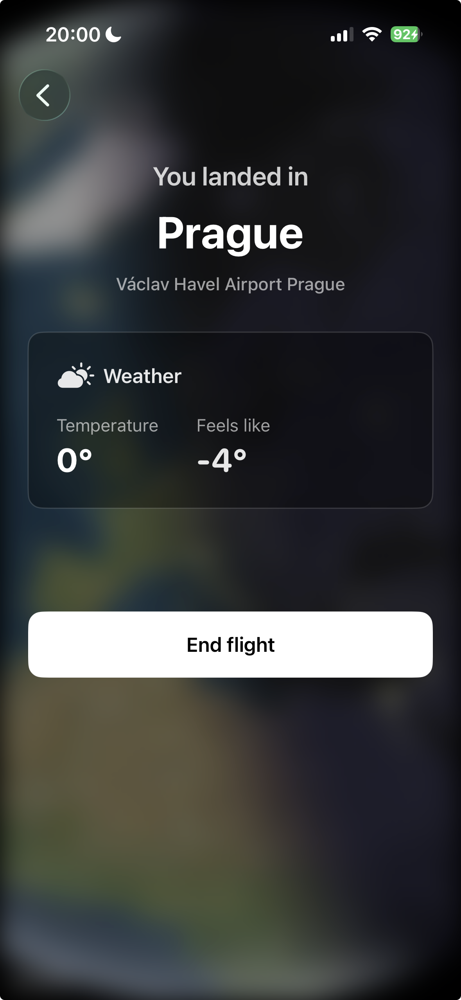

# FocusFlight ✈️


Таймер для фокусировки в виде виртуального полёта между аэропортами: вы задаёте длительность «полёта», приложение подбирает направления по удалённости и показывает движение самолёта на карте в реальном времени.

## Описание

При первом запуске вы один раз выбираете **домашний аэропорт**. Дальше с главного экрана можно забронировать полёт: выбираете **длительность** (от 15 минут до 20 часов) — приложение показывает аэропорты в диапазоне «выбранное время ± 10 минут». После взлёта самолёт движется по маршруту (great circle), по прилёту показывается экран приземления с погодой; кнопка **«Завершить полет»** возвращает на главный экран. Следующий полёт начинается уже из аэропорта, в который вы «прилетели».

### Основные возможности

- 🏠 **Домашний аэропорт** — задаётся один раз при первом входе
- 🗺️ **3D-глобус** — фон главного экрана по текущей точке (последнее приземление или дом); на экранах выбора/подтверждения/приземления — размытый глобус
- ⏱️ **Колесо длительности** — от 15 минут до 20 часов с шагом 15 минут
- 📍 **Направления по времени** — аэропорты в диапазоне «длительность ± 10 минут» от текущей точки вылета
- ✈️ **Полёт на карте** — маршрут по дуге большого круга, камера следования/обзор, метрики (время, расстояние)
- 🎧 **Звуки** — салон и объявление о ремнях
- 🌤️ **Погода** — в аэропорту приземления
- 📜 **История полётов** — сохранённые маршруты с отметкой о завершённости (пролетел до конца или нет)

## Скриншоты

## Скриншоты

| Главный экран | Выбор направления | Экран полёта | Приземление |
| :---: | :---: | :---: | :---: |
|  |  |  |  |
| *Выбор домашнего аэропорта* | *Выбор длительности полёта* | *Карта с движущимся самолётом* | *Погода в пункте назначения* |


## Технологии

- **SwiftUI** — UI
- **MapKit** — карты, 3D-глобус, камера, маршруты
- **Combine** — реактивные потоки и привязки
- **Modern Concurrency** — async/await для загрузки аэропортов и подготовки полёта без блокировки UI
- **AVFoundation** — звук

## Архитектура

- **MVVM** — у экранов BookFlight, Onboarding, Landed, Flight есть отдельные ViewModel’ы
- **Слои:** Core (модели, расширения, тема), Data (репозитории и сервисы), Presentation (экраны и общие компоненты)
- **Репозитории** — персистенция истории полётов и состояния приложения (домашний аэропорт, текущая точка вылета, онбординг)
- **Сервисы** — FlightHistoryService, MapService, AirportLoadingService, SoundService, WeatherService, FlightTimerService

## Требования

- iOS 17.0+
- Xcode 15.0+

## Структура проекта

```
FocusFlight/
├── App/                        # Точка входа, RootView (онбординг / главный экран)
├── Core/
│   ├── Models/                 # Airport, Flight, StoredFlight, Weather
│   ├── Extensions/             # GeoExtensions (расстояние, углы)
│   └── Theme/                  # Стили и константы
├── Data/
│   ├── Repositories/           # FlightHistoryRepository, AppStateRepository
│   └── Services/              # FlightHistoryService, AirportLoadingService, MapService, SoundService, WeatherService, FlightTimerService
├── Presentation/
│   ├── Main/                   # Главный экран (приветствие, город, кнопки)
│   ├── BookFlight/             # Выбор длительности и аэропорта назначения
│   ├── Onboarding/             # Выбор домашнего аэропорта (один раз)
│   ├── CheckIn/                # Подтверждение вылета
│   ├── Flight/                 # Экран полёта (карта, метрики, звуки)
│   ├── Landed/                 # Приземление, погода, «Завершить полет»
│   ├── History/                # История полётов
│   └── Shared/                 # GlobeBackgroundView, AirportSelection
└── Resources/                  # airports.json, Assets.xcassets, Sounds, Screenshots
```

## Лицензия

⚠️ **Важно:** этот проект — **учебная копия** приложения [FocusFlight](https://apps.apple.com/app/focusflight-focus-timer/id6503270459).

Создан в **образовательных целях** для изучения SwiftUI, MapKit, MVVM, Combine, современной конкурентности и организации кода (SOLID, репозитории, сервисы).

**Публикация в App Store не планируется.**

---

*Разработано в учебных целях, 2026*
